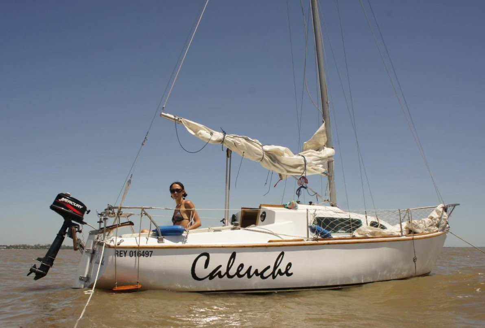

# La tripulación

Somos Gisela y Lars y estamos viviendo abordo de nuestro
[Velero](./velero) en Buenos Aires, Argentina.

En Año Nuevo (2010-2011) visitábamos Copenhague (Dinamarca) y, a pesar
de las varias maravillas del lugar, Gisela quedó enamorada del puerto
y surgió la idea de navegar a vela. En Buenos Aires, la náutica es un
deporte al que sino tenés acceso por tu familia, resulta difícil
acercarse.

De regreso en Buenos Aires, en el 2011 Gisela se subió por primera vez
a un velero en el curso de Timonel. Lars, físico enamorado de las
fuerzas de la naturaleza, se entusiasmó con la idea de navegar en el
Río de la Plata y en 2012 nos compramos nuestro primer velero; un H20:
_Caleuche_ que disfrutamos mucho y donde invertimos muchas horas para
mejorarlo. ¡Hasta le metimos un Frigobar! :)

En 2014, era evidente que pasábamos más noches en el barquito de 20
pies que en nuestro departamento… entonces hicimos lo más lógico:
¡comprar un velero más grande y dejar la tierra firme! _Libero_, un
Plenamar 30, que también recibió mucho cariño. Con él hicimos nuestro
primer cruce a Uruguay y otros tantos viajes. Cuando llegamos
navegando a Punta del Este decidimos que probablemente necesitábamos
algo más grande. Llegás a Punta y te pinta eso... o quizás nos pusimos
un poco más grandes.

Desde el 2017 tenemos el _Samurai_ que es un Alpha 36 con aparejo
queche. Acá queremos compartir algunas de las cosas que fuimos
haciendo en el barco y algo más.

